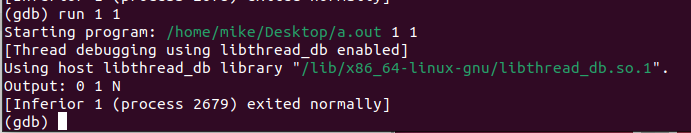
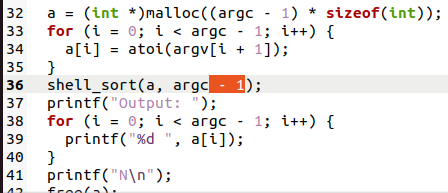

# Отчёт
## _Тестирование программы_

Можем заметить, что на тесте из двух 1 в выводе вдруг появляется 0.
Значит программа работает неверно, запустим дебаг.

## _Поиск ошибки_

Заметим, что на нашем тесте 1 1 размер должен быть 2, а мы обращаемся к a[i]
при i = 2, то есть мы выходим из цикла слишком поздно.

## _Исправим ошибку_

## _Вновь протестируем программу_

)
